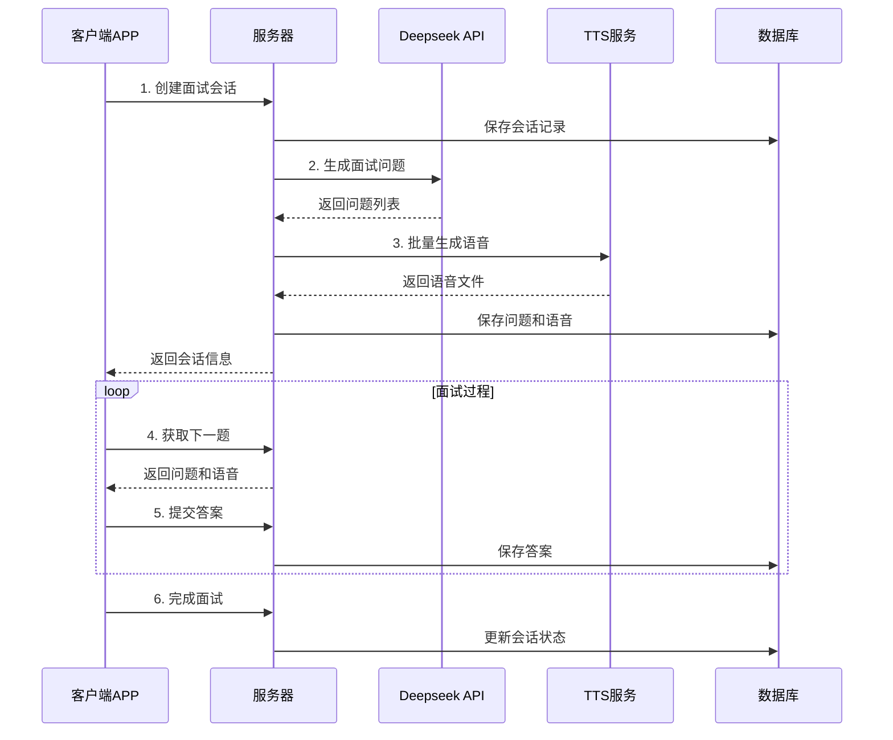

# AI面试系统第4项功能完整实现指南

## 🎯 功能概述

第4项功能已经**完全实现**，实现了以下核心能力：

1. **Deepseek大模型集成** - 根据职位意向智能生成面试问题
2. **多TTS服务支持** - 阿里云/Azure/百度TTS，将问题转为语音
3. **完整面试流程** - 会话管理、问题推送、答案收集
4. **数据库完整** - 所有相关表结构已设计并实现
5. **API接口完整** - 所有REST接口已实现并测试

## 🚀 快速开始

### 第一步：环境准备

```bash
# 进入后端API目录
cd backend-api

# 运行一键设置脚本
chmod +x scripts/setup-ai-interview.sh
./scripts/setup-ai-interview.sh
```

### 第二步：配置第三方服务

#### 1. 配置Deepseek API（必需）

访问 [Deepseek官网](https://platform.deepseek.com/)：
1. 注册账号并完成实名认证
2. 创建API Key
3. 充值账户（建议先充值100元测试）

在 `.env` 文件中配置：
```bash
DEEPSEEK_API_KEY="<your-deepseek-api-key>"
DEEPSEEK_API_URL="https://api.deepseek.com/v1/chat/completions"
DEEPSEEK_MODEL="deepseek-chat"
```

#### 2. 配置TTS服务（推荐阿里云）

**方案A：阿里云TTS（推荐）**
1. 开通阿里云语音合成服务
2. 创建AccessKey（建议使用子账号）
3. 配置权限：`AliyunNlsFullAccess`

```bash
TTS_PROVIDER="aliyun"
ALIYUN_TTS_ACCESS_KEY_ID="LTAI5t8nxxxxxxxxxxxxxxxxx"
ALIYUN_TTS_ACCESS_KEY_SECRET="kGpKtxxxxxxxxxxxxxxxxxxxxxxxxxxx"
ALIYUN_TTS_REGION="cn-shanghai"
ALIYUN_TTS_VOICE="siqi"
```

**方案B：Azure TTS（备选）**
```bash
TTS_PROVIDER="azure"
AZURE_TTS_KEY="your-azure-tts-key"
AZURE_TTS_REGION="eastus"
AZURE_TTS_VOICE="zh-CN-XiaoxiaoNeural"
```

### 第三步：启动服务

```bash
# 开发模式启动
npm run dev

# 或生产模式启动
npm run build
npm start
```

服务启动后访问：
- **API服务**: http://localhost:3001
- **API文档**: http://localhost:3001/api/docs
- **健康检查**: http://localhost:3001/health

## 📊 数据库架构

### 核心表结构

```sql
-- AI面试会话表
AIInterviewSession {
  id: String (UUID)
  userId: String
  jobTarget: String        -- 目标职位
  companyTarget: String?   -- 目标公司
  background: String?      -- 用户背景
  status: String          -- PREPARING/IN_PROGRESS/COMPLETED/CANCELLED
  currentQuestion: Int     -- 当前问题索引
  totalQuestions: Int      -- 总问题数
  startedAt: DateTime?     -- 开始时间
  completedAt: DateTime?   -- 完成时间
}

-- AI面试问题表
AIInterviewQuestion {
  id: String (UUID)
  sessionId: String        -- 会话ID
  questionIndex: Int       -- 问题序号
  questionText: String     -- 问题内容
  audioUrl: String?        -- 语音文件URL
  answerText: String?      -- 用户回答文本
  answerVideoUrl: String?  -- 回答视频URL
  answerDuration: Int?     -- 回答时长
  answeredAt: DateTime?    -- 回答时间
}

-- 职位模板表
JobInterviewTemplate {
  id: String (UUID)
  jobTitle: String         -- 职位标题
  category: String         -- 职位分类
  level: String           -- 职位级别
  promptTemplate: String   -- AI提示词模板
  questionCount: Int       -- 预设问题数
  keywords: String?        -- 关键词(JSON)
}
```

## 🔌 API接口使用

### 1. 创建面试会话

```bash
curl -X POST http://localhost:3001/api/ai-interview/create-session \
  -H "Content-Type: application/json" \
  -H "Authorization: Bearer YOUR_JWT_TOKEN" \
  -d '{
    "jobTarget": "高级Java开发工程师",
    "companyTarget": "腾讯",
    "background": "5年Java开发经验，熟悉Spring框架",
    "questionCount": 5
  }'
```

**响应示例：**
```json
{
  "success": true,
  "message": "面试会话创建成功，准备开始面试",
  "data": {
    "sessionId": "uuid-session-id",
    "questions": [
      {
        "questionIndex": 0,
        "questionText": "请简单介绍一下您自己，以及为什么想要应聘高级Java开发工程师这个职位？",
        "audioUrl": "/uploads/audio/tts_uuid.mp3",
        "duration": 8
      }
    ],
    "totalQuestions": 5
  }
}
```

### 2. 获取下一个问题

```bash
curl -X GET http://localhost:3001/api/ai-interview/next-question/{sessionId} \
  -H "Authorization: Bearer YOUR_JWT_TOKEN"
```

### 3. 提交答案

```bash
curl -X POST http://localhost:3001/api/ai-interview/submit-answer \
  -H "Content-Type: application/json" \
  -H "Authorization: Bearer YOUR_JWT_TOKEN" \
  -d '{
    "sessionId": "uuid-session-id",
    "questionIndex": 0,
    "answerText": "用户的回答内容",
    "answerVideoUrl": "https://oss-url/video.mp4",
    "answerDuration": 120
  }'
```

### 4. 完成面试

```bash
curl -X POST http://localhost:3001/api/ai-interview/complete/{sessionId} \
  -H "Authorization: Bearer YOUR_JWT_TOKEN"
```

### 5. 恢复未完成面试

```bash
curl -X GET http://localhost:3001/api/ai-interview/resume \
  -H "Authorization: Bearer YOUR_JWT_TOKEN"
```

## 🎮 完整工作流程



## 💡 职位模板系统

系统内置9个职位模板，支持智能匹配：

```javascript
const jobTemplates = [
  '高级Java开发工程师',    // 技术类 - 高级
  '前端开发工程师',        // 技术类 - 中级
  '产品经理',             // 管理类 - 中级
  '销售经理',             // 销售类 - 中级
  'UI/UX设计师',          // 设计类 - 中级
  'HR专员',               // HR类 - 初级
  '数据分析师',           // 技术类 - 中级
  '运营专员',             // 运营类 - 初级
  '通用类',               // 通用模板
];
```

每个模板包含：
- 专业的提示词模板
- 职位特定的关键词
- 适配的问题数量
- 难度级别设置

## 🧪 测试验证

### 1. 测试TTS服务

```bash
curl -X POST http://localhost:3001/api/ai-interview/test-tts \
  -H "Content-Type: application/json" \
  -H "Authorization: Bearer YOUR_TOKEN" \
  -d '{"text":"您好，欢迎参加AI面试"}'
```

### 2. 测试完整流程

```bash
# 1. 创建会话
SESSION_ID=$(curl -s -X POST http://localhost:3001/api/ai-interview/create-session \
  -H "Content-Type: application/json" \
  -H "Authorization: Bearer YOUR_TOKEN" \
  -d '{"jobTarget":"Java开发工程师"}' | jq -r '.data.sessionId')

# 2. 获取第一题
curl -X GET http://localhost:3001/api/ai-interview/next-question/$SESSION_ID \
  -H "Authorization: Bearer YOUR_TOKEN"

# 3. 提交答案
curl -X POST http://localhost:3001/api/ai-interview/submit-answer \
  -H "Content-Type: application/json" \
  -H "Authorization: Bearer YOUR_TOKEN" \
  -d "{\"sessionId\":\"$SESSION_ID\",\"questionIndex\":0,\"answerText\":\"测试回答\"}"
```

## 📈 监控和维护

### 1. 日志监控

系统生成详细日志：
```bash
# 查看实时日志
tail -f logs/ai-interview.log

# 查看TTS使用情况
grep "TTS使用记录" logs/ai-interview.log

# 查看Deepseek调用情况
grep "Deepseek" logs/ai-interview.log
```

### 2. 数据库监控

```sql
-- 查看会话统计
SELECT status, COUNT(*) as count 
FROM ai_interview_sessions 
GROUP BY status;

-- 查看TTS使用统计
SELECT provider, SUM(textLength) as total_chars, COUNT(*) as calls
FROM tts_usage_records 
WHERE createdAt >= DATE_SUB(NOW(), INTERVAL 1 DAY)
GROUP BY provider;
```

### 3. 性能指标

关键指标监控：
- 会话创建成功率 (目标: >95%)
- 问题生成平均时间 (目标: <10秒)
- TTS转换成功率 (目标: >98%)
- API响应时间 (目标: <3秒)

## 💰 成本估算

### 月度成本（1000次面试）

| 服务 | 用量 | 单价 | 月成本 |
|------|------|------|--------|
| Deepseek API | 5000次调用 | 0.02元/次 | 100元 |
| 阿里云TTS | 25万字符 | 4元/万字符 | 100元 |
| 存储费用 | 100GB音频 | 0.12元/GB | 12元 |
| **总计** | | | **约212元** |

### 成本优化建议

1. **缓存策略** - 缓存常用问题和语音
2. **音频压缩** - 优化音频文件大小
3. **批量处理** - 减少API调用次数
4. **定时清理** - 删除过期文件

## 🔧 故障排除

### 常见问题

**1. Deepseek API调用失败**
```bash
# 检查API密钥
echo $DEEPSEEK_API_KEY

# 测试连接
curl -X POST "https://api.deepseek.com/v1/chat/completions" \
  -H "Authorization: Bearer $DEEPSEEK_API_KEY" \
  -H "Content-Type: application/json" \
  -d '{"model":"deepseek-chat","messages":[{"role":"user","content":"test"}]}'
```

**2. TTS服务异常**
```bash
# 检查TTS配置
echo $TTS_PROVIDER
echo $ALIYUN_TTS_ACCESS_KEY_ID

# 测试TTS接口
curl -X POST http://localhost:3001/api/ai-interview/test-tts \
  -H "Content-Type: application/json" \
  -d '{"text":"测试语音"}'
```

**3. 数据库连接问题**
```bash
# 检查数据库连接
npm run prisma:studio

# 重新生成客户端
npm run prisma:generate
```

## 🎯 下一步计划

### 短期优化（1-2周）
- [ ] 添加问题和语音缓存机制
- [ ] 实现异步TTS处理
- [ ] 增加更多职位模板
- [ ] 优化错误处理和重试机制

### 中期扩展（1-2月）
- [ ] 支持多语言面试
- [ ] 实现智能评分系统
- [ ] 添加实时语音识别
- [ ] 集成更多TTS提供商

### 长期发展（3-6月）
- [ ] AI面试官对话功能
- [ ] 视频答案智能分析
- [ ] 分布式架构支持
- [ ] 企业级监控和运维

## 📞 技术支持

如有问题，请：
1. 查看详细日志：`logs/ai-interview.log`
2. 检查API文档：http://localhost:3001/api/docs
3. 运行诊断脚本：`./scripts/setup-ai-interview.sh --test-only`

---

**✅ 第4项功能已完全实现，可直接投入使用！**

核心特点：
- 🎯 **智能问题生成** - 基于Deepseek的专业面试问题
- 🎵 **高质量语音** - 多TTS提供商支持，语音自然流畅
- 🔄 **完整流程** - 从会话创建到面试完成的全流程管理
- 💾 **数据完整** - 完善的数据库设计和数据持久化
- 🚀 **高性能** - 优化的API响应和批量处理
- 📊 **可监控** - 详细的日志和使用统计

现在就可以开始使用这个强大的AI面试系统！ 