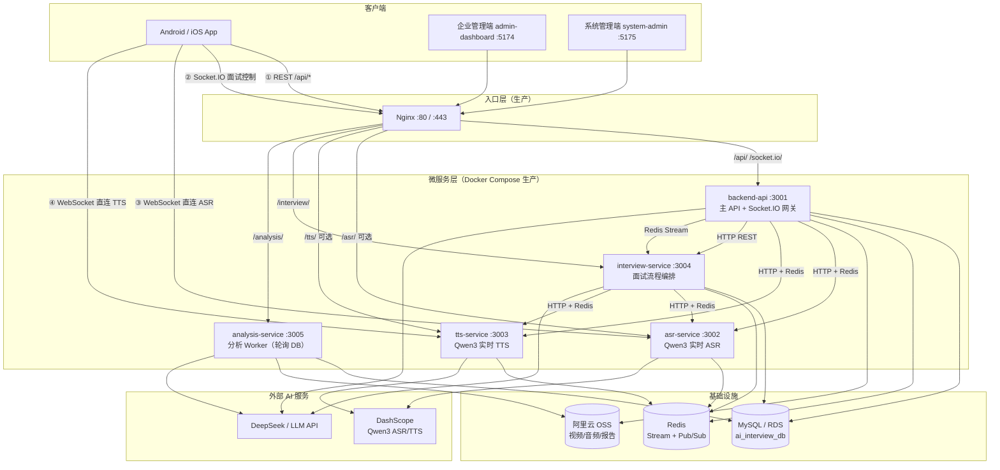
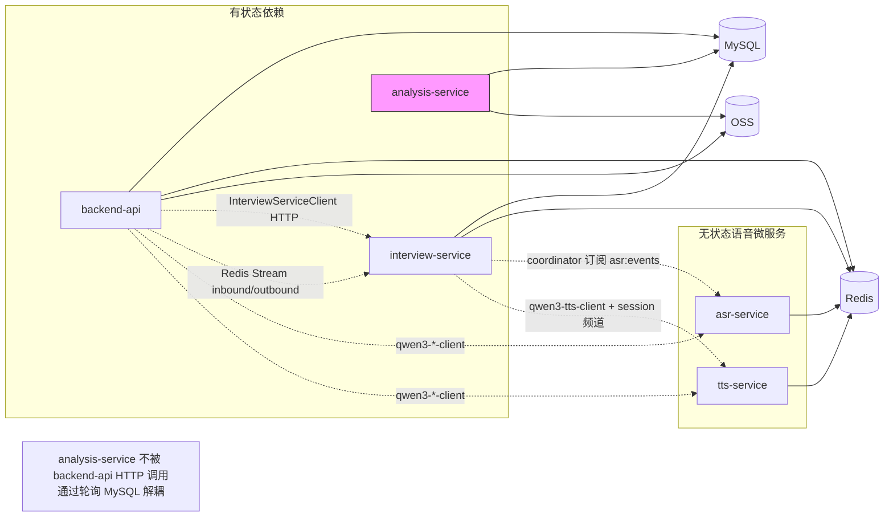
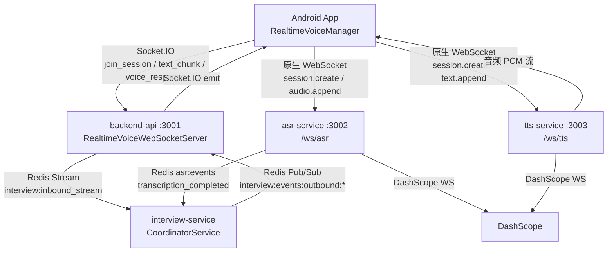
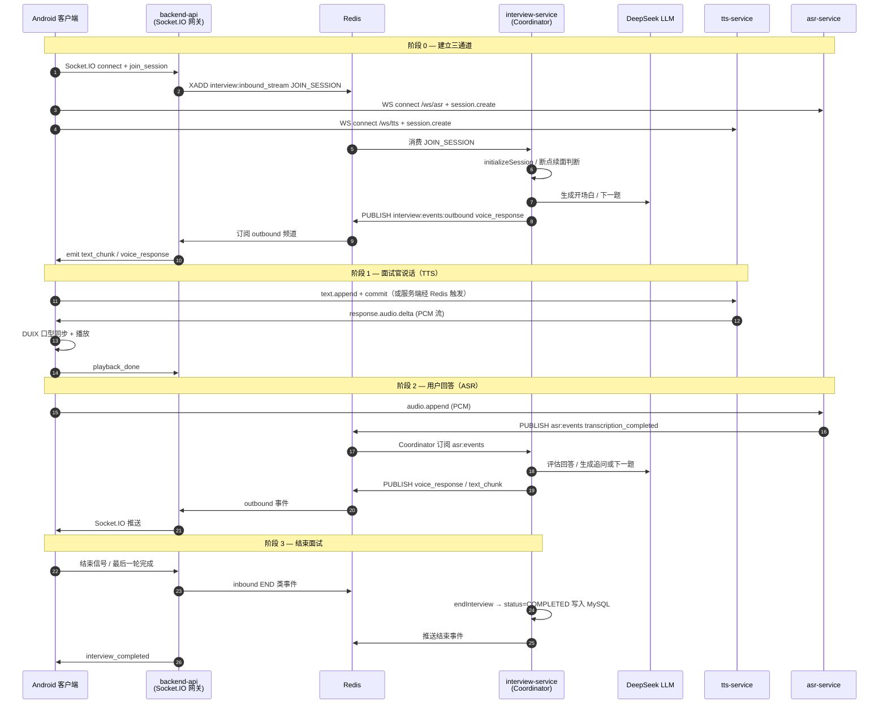
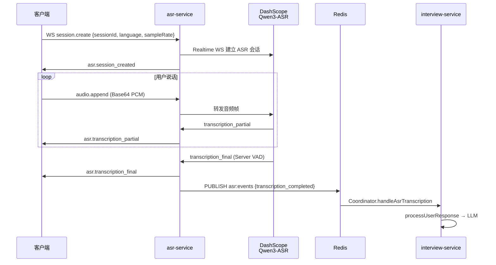
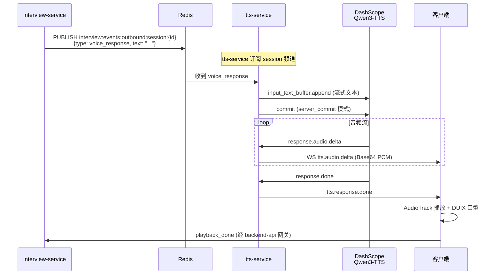
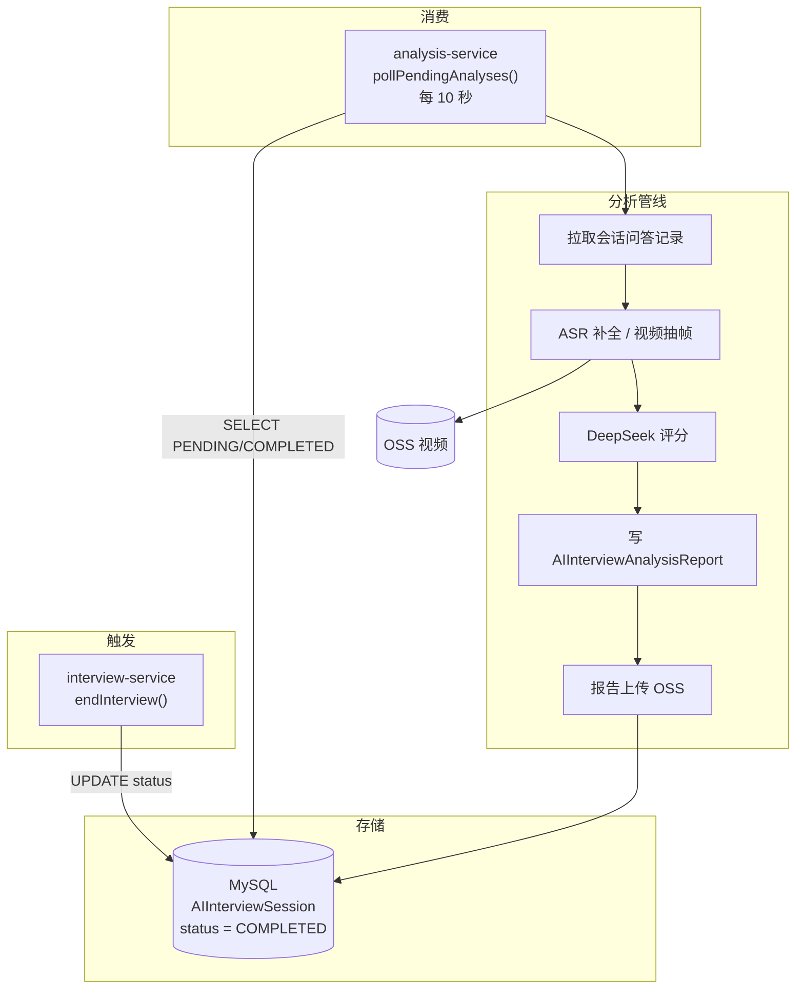
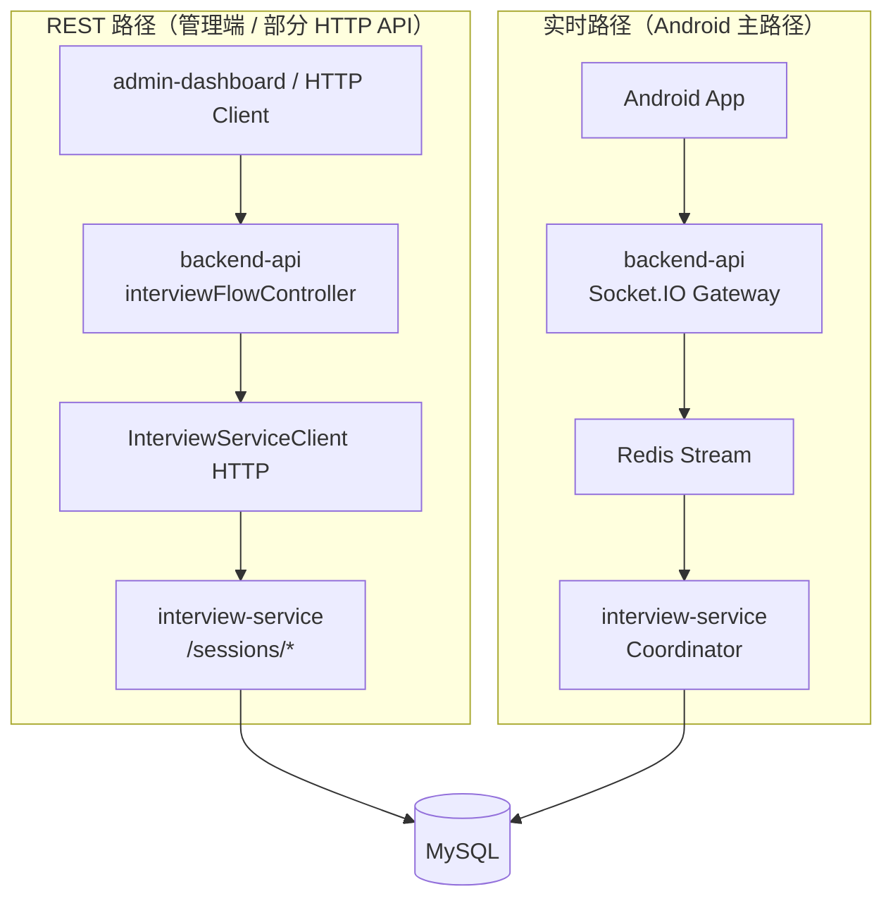
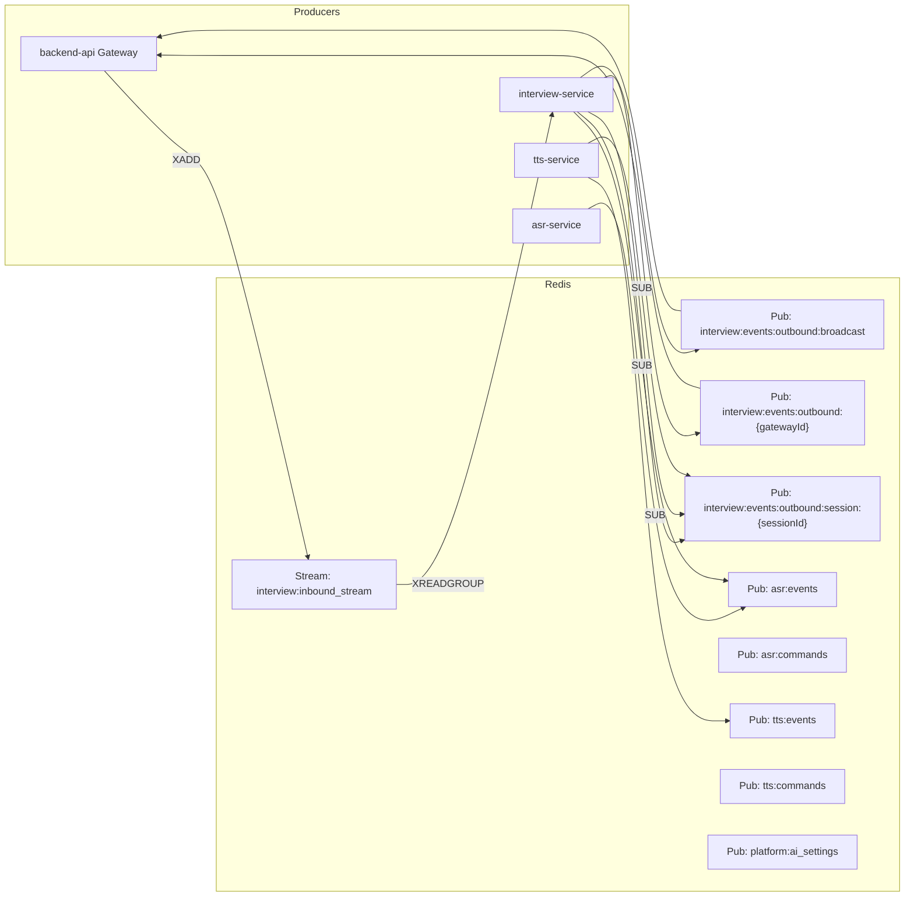

# AI 面试系统 — 当前代码架构与业务流

> 基于仓库代码梳理，反映 **as-is** 实现（非目标架构）。  
> 最后更新：2026-05-20

---

## 1. 总体部署架构

### 端口一览

| 服务 | 端口 | 协议 | 职责 |
|------|------|------|------|
| backend-api | 3001 | HTTP + Socket.IO | 认证、业务 API、实时网关 |
| asr-service | 3002 | HTTP + WebSocket `/ws/asr` | 实时语音识别 |
| tts-service | 3003 | HTTP + WebSocket `/ws/tts` | 实时语音合成 |
| interview-service | 3004 | HTTP REST | 面试状态机、LLM 编排 |
| analysis-service | 3005 | HTTP `/health` only | 异步分析报告生成 |

---

## 2. 服务依赖关系（代码级）

**要点：**

- `backend-api` 与 `interview-service` 之间存在 **双通道**：HTTP REST + Redis Stream。
- `analysis-service` 是独立 Worker，**没有** `ANALYSIS_SERVICE_URL` 之类的同步调用。
- `interview-service` 内含 `analysisQueue.ts`（与 analysis-service 重复），但 `index.ts` **未启动**该队列。

---

## 3. 客户端三通道连接

App 在一次实时面试中同时维护 **三条独立连接**：

| 通道 | 协议 | 默认地址 | 用途 |
|------|------|----------|------|
| 业务控制 | Socket.IO | `http(s)://host:3001` | 加入会话、LLM 文本块、状态同步 |
| 语音识别 | WebSocket | `ws://host:3002/ws/asr` | 麦克风 PCM 上行、识别结果 |
| 语音合成 | WebSocket | `ws://host:3003/ws/tts` | 面试官语音下行、口型驱动 |

配置下发：`GET /api/public/client-runtime-config` 或 Socket 事件 `get_service_config`。

---

## 4. 实时面试主业务流（Sequence）

### Socket.IO 主要事件（客户端 ↔ backend-api）

| 方向 | 事件 | 说明 |
|------|------|------|
| C → G | `join_session` | 加入面试房间，触发 JOIN_SESSION |
| C → G | `text_message` | 文本模式输入（不经 ASR） |
| C → G | `playback_done` | TTS 播放完毕，切换 listening |
| C → G | `stop_tts` | 打断 TTS |
| G → C | `session_joined` | 加入成功 |
| G → C | `text_chunk` | LLM 流式文本（字幕） |
| G → C | `voice_response` | 需播放的语音文本 + metadata |

---

## 5. ASR 语音识别流

**Redis 频道：**

| 频道 | 方向 | 内容 |
|------|------|------|
| `asr:events` | ASR → 订阅方 | 识别结果、VAD 事件 |
| `asr:commands` | backend/interview → ASR | 控制指令 |

---

## 6. TTS 语音合成流（双轨混合流式）

**说明：** 客户端也可直接向 TTS 发送 `text.append`（`Qwen3TtsWsClient.speak()`），与服务端 Redis 触发并存。

---

## 7. 异步分析业务流

**与 backend-api 的关系：** 无直接 HTTP 调用。管理端通过 `backend-api` 读取 MySQL 中已生成的报告。

---

## 8. REST API 路径 vs 实时路径

系统存在 **两套** 面试流程入口，历史原因并存：

| 场景 | 推荐路径 |
|------|----------|
| Android 实时 AI 面试 | Socket.IO → Redis Stream → interview-service |
| 企业管理端调试 / HTTP 集成 | backend-api REST → InterviewServiceClient |
| 面试分析报告 | analysis-service 轮询 DB（异步） |

---

## 9. Redis 总线全景

---

## 10. 生产 Nginx 路由

| 外部路径 | 上游服务 | 备注 |
|----------|----------|------|
| `/api/` | backend-api:3001 | REST API |
| `/socket.io/` | backend-api:3001 | Socket.IO 长连接 |
| `/asr/` | asr-service:3002 | WebSocket 反代（可选） |
| `/tts/` | tts-service:3003 | WebSocket 反代（可选） |
| `/interview/` | interview-service:3004 | 一般内网调用 |
| `/analysis/` | analysis-service:3005 | 仅 health |
| `/uploads/` | 静态卷 | 本地上传文件 |

---

## 11. 已知架构债务（代码 as-is）

| 项 | 说明 |
|----|------|
| 分析双实现 | `interview-service/jobs/analysisQueue.ts` 与 `analysis-service` 功能重复，后者实际运行 |
| backend-api 遗留分析 | `aiService.analyzeInterview` 仍存在，与新 Worker 架构并存 |
| 双面试入口 | REST Client 与 Redis Stream 两套路径，需明确各自适用场景 |
| ASR/TTS 多调用方 | backend-api 与 interview-service 均可触发 TTS，需保持一致 |

---

## 12. 相关源码索引

| 模块 | 关键文件 |
|------|----------|
| 部署 | `docker-compose.prod.yml`, `deploy-prod.sh`, `nginx/nginx.prod.conf` |
| 网关 | `backend-api/src/websocket/realtime-voice.websocket.ts` |
| 编排 | `interview-service/src/services/coordinator.service.ts` |
| ASR | `asr-service/src/index.ts`, `asr-service/src/redis-event-bus.ts` |
| TTS | `tts-service/src/index.ts`, `tts-service/src/tts-session-manager.ts` |
| 分析 | `analysis-service/src/index.ts`, `analysis-service/src/services/analysisService.ts` |
| Android | `android-v0-compose/.../RealtimeVoiceManager.kt`, `AppConfig.kt` |
| 架构文档 | `docs/QWEN3_SPEECH_ARCHITECTURE.md` |
