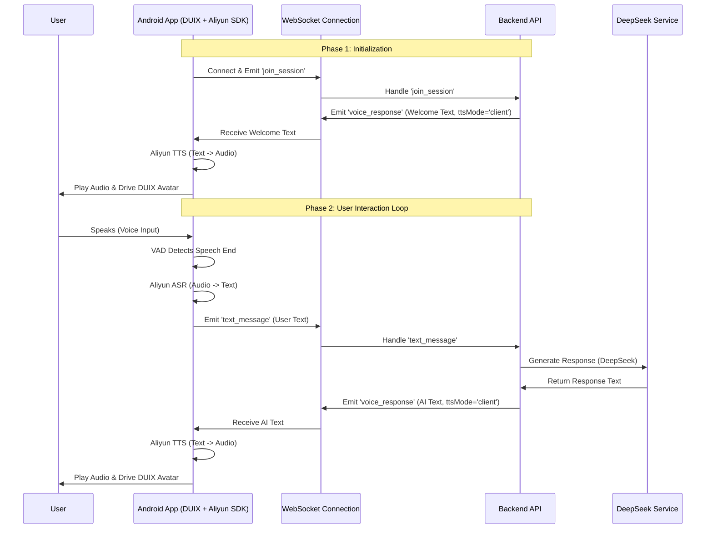

# Digital Human Interview Lifecycle (Implemented Architecture)

This document outlines the **implemented** lifecycle of the Digital Human Interview process, optimized for the user's requirements: **App-side ASR/TTS** and **Backend-side Intelligence**.

## 1. Architecture Overview

The system uses a **Hybrid Architecture**:
*   **Android App**: Handles all "Senses" (Hearing via ASR, Speaking via TTS, Seeing via Camera).
*   **Backend API**: Handles the "Brain" (Interview Logic, LLM Processing).

## 2. Detailed Data Flow

### Phase 1: Session Initialization
*   **Trigger**: User enters the interview screen.
*   **App Action**: `RealtimeVoiceManager.initialize()` connects to WebSocket.
*   **Event**: `join_session`
*   **Backend Action**:
    *   Generates welcome text.
    *   **Crucial Change**: Does **NOT** generate audio.
    *   Emits `voice_response` with `ttsMode: 'client'` and `text: "Welcome..."`.
*   **App Response**:
    *   Detects `ttsMode: 'client'`.
    *   Calls `AliyunSpeechService.synthesizeSpeech()` to generate audio locally.
    *   Plays audio to drive the Digital Human.

### Phase 2: User Input (Client-Side ASR)
*   **Trigger**: User speaks.
*   **App Action**:
    *   **VAD**: Detects end of speech.
    *   **ASR**: `AliyunSpeechService.recognizePcm()` converts audio to text locally.
    *   **Transport**: Sends **Text** to backend via `text_message`.
*   **Optimization**: No audio data is ever sent to the backend, saving bandwidth and server processing power.

### Phase 3: Intelligence (Backend LLM)
*   **Trigger**: Backend receives `text_message`.
*   **Backend Action**:
    *   Calls `DeepseekService` to generate a response.
    *   **Optimization**: Skips server-side TTS.
    *   Emits `voice_response` with `ttsMode: 'client'` and the AI's text.

### Phase 4: Response (Client-Side TTS)
*   **Trigger**: App receives `voice_response`.
*   **App Action**:
    *   Reads `ttsMode: 'client'`.
    *   **TTS**: Calls `AliyunSpeechService.synthesizeSpeech()` to convert the AI's text to an audio file.
    *   **Playback**: Plays the audio file.
    *   **Animation**: DUIX SDK uses the playing audio to animate the avatar's lips and face.

## 3. Code Changes Implemented

### Backend (`backend-api`)
1.  **Removed `audio_data` Handler**: The backend no longer accepts raw audio streams, enforcing the client-side ASR requirement.
2.  **Updated `text_message` Handler**: Removed any dependency on server-side TTS pipelines. It now strictly calls the LLM and returns text with `ttsMode: 'client'`.
3.  **Updated `join_session` Handler**: The welcome message is now sent as text-only, forcing the client to synthesize the welcome audio.

### Android App (`android-v0-compose`)
*   **Verified**: `RealtimeVoiceManager` correctly handles `ttsMode: 'client'` by invoking `AliyunSpeechService`.
*   **Verified**: `AliyunSpeechService` implements `synthesizeSpeech` using Aliyun's REST API.
*   **Verified**: No code exists to send `audio_data` to the backend; it strictly sends `text_message` after local ASR.

## 4. Benefits of this Approach
*   **Lower Latency**: ASR and TTS happen on the edge (device), reducing round-trip times for audio data.
*   **Reduced Server Cost**: The backend only handles text (tokens), avoiding expensive server-side speech-to-text and text-to-speech processing.
*   **Privacy**: User's voice audio is processed locally (or via direct Aliyun connection from device) and not stored/processed on your application server.
